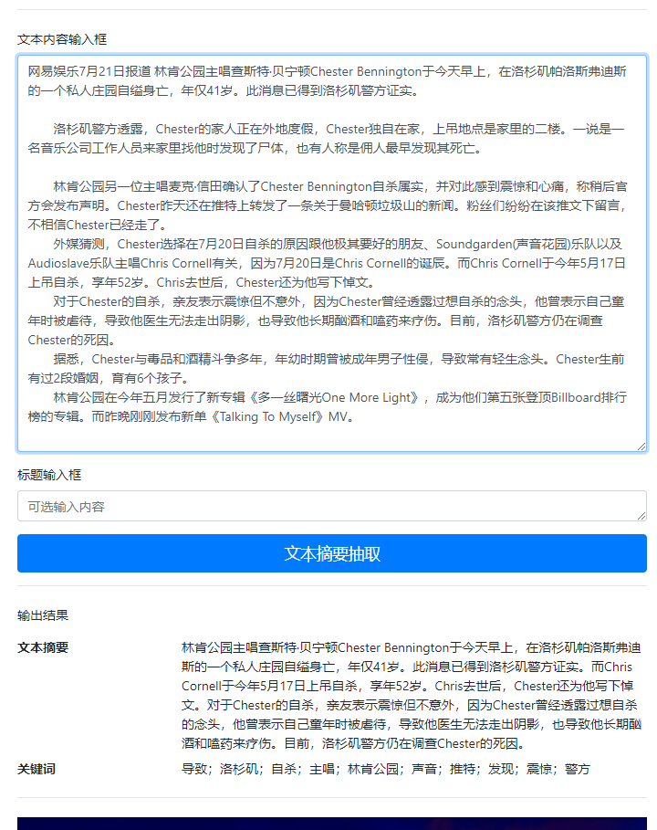

文本摘要的应用场景有很多，比如搜索引擎、观点抽取、新闻、汇报文档等。

摘要技术分为两类：

- Extractive是从文中找出关键信息，然后拼接进行结果输出
    - 关键信息识别抽取
- Abstracrtive: 依据文本的输入，生成单词（可能是新的单词）进行结果输出
    - Seq2Seq
    - Pointer Generator
    - Transfomer

本项目是基于一种Unsupervised extractive Summarization方法实现的。

## 项目流程

项目采用Extractive的思路，同时对 [Pointer Generator](pointer/)， [Transfomer based Pointer Generator](pointer/transformer)，进行了实验。[实验数据集](https://github.com/wonderfulsuccess/chinese_abstractive_corpus)是有监督的，而此任务的数据集没有参考摘要，因此只进行了算法研究和实验，没有应用到本项目的实际应用中。

1. data analysis
1. data process
1. 基于sentence embedding的关键句信息抽取
    - 距离度量：cosine similarity
1. 语句流畅性平滑
    - 近邻sentence embedding平均化平滑方法
1. Title、keywords加权修正
    - 标题的embedding赋予更高的权重，在相似性计算时进行处理
    - textrank关键词提取，计算sentence embedding时加权处理
    - 基于位置信息的加权处理：段落开端，结尾一般会更加重要
1. 基于LDA的主题相关性修正
7. 结合BM25的textrank关键句抽取算法，对比优化的sentence embedding。

### Flask网页效果展示

